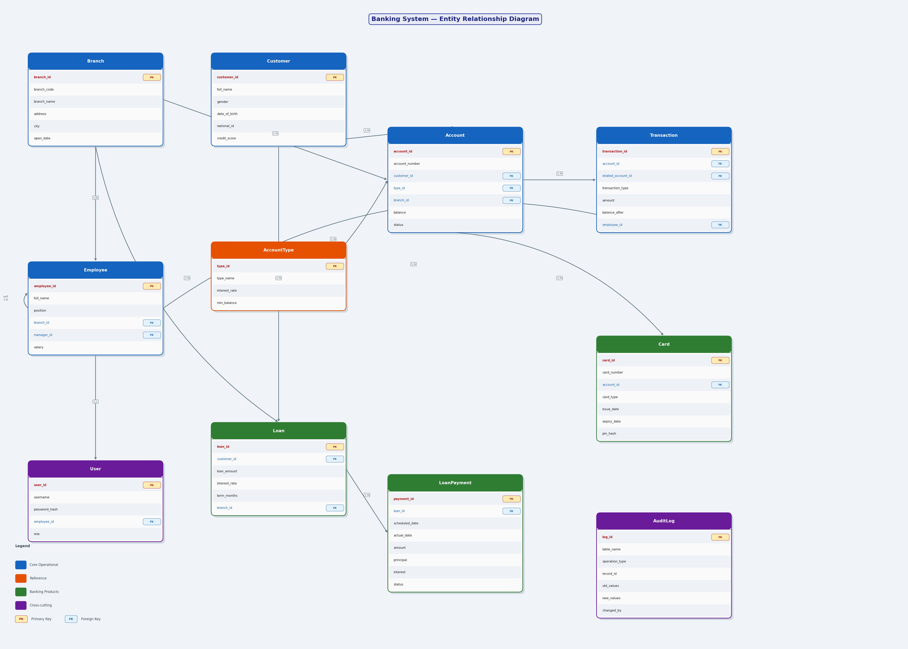

# Banking Management System

A full-featured retail banking back-office system built with **MySQL 8** and **Python 3.11** for the Database Management Systems course at National Economics University.

This project simulates core banking operations including:

- Customer management
- Bank account management
- Transaction processing
- Loan management
- Card services
- Employee & branch hierarchy
- Authentication & role-based access

Designed with enterprise-style relational database principles including normalization, constraints, indexing, stored procedures, triggers, and transactional integrity.

---

# Project Overview

This system was developed as a semester-long DBMS project to demonstrate:

- Relational database design
- SQL schema implementation
- Data generation & ETL
- Advanced MySQL objects
- Database optimization
- Python database integration

The project follows a modular architecture separating:

- Documentation
- SQL scripts
- Data generation
- Application layer
- Reporting assets

---

# Tech Stack

| Layer | Technology |
|---|---|
| Database | MySQL 8 |
| Backend | Python 3.11 |
| Database Driver | mysql-connector-python |
| Data Generation | Faker |
| Data Processing | Pandas |
| GUI (planned) | Tkinter |
| IDE / DB Tool | MySQL Workbench / DBeaver |

---

# System Features

## Customer Management
- Store customer profiles securely
- AES-encrypted national ID storage
- Address and contact management

## Account Management
- Savings / checking account support
- Multiple accounts per customer
- Balance tracking and account status control

## Transaction System
- Deposit / withdrawal / transfer operations
- Large-scale synthetic transaction dataset
- Batch insertion optimization

## Loan Management
- Loan issuance and repayment tracking
- Loan payment history
- Interest and status management

## Card Management
- Debit / credit card support
- Expiration and status tracking

## Employee & Branch Management
- Branch hierarchy
- Employee-manager relationships
- Role-based permissions

## Authentication
- Demo login accounts
- Admin / Manager / Teller / Auditor roles

---

# Database Design

## Core Concepts Implemented

- Primary & Foreign Keys
- CHECK constraints
- UNIQUE constraints
- One-to-many relationships
- Referential integrity
- Composite indexing
- Data encryption
- Transaction-safe operations

## Schema Statistics

| Object | Count |
|---|---|
| Tables | 11 |
| Customers | ~1500 |
| Accounts | ~2500 |
| Transactions | 50000 |
| Loans | 300 |
| Loan Payments | ~6000 |
| Cards | ~1750 |

---

# Project Structure

```text
banking_management_system/
├── README.md
├── docs/
│   ├── 01_requirements_analysis.md
│   ├── 02_database_design.md
│   ├── 03_advanced_objects.md
│   └── 04_application.md
│
├── sql/
│   ├── 01_create_database.sql
│   ├── 02_advanced_objects.sql
│   └── 03_indexes_optimization.sql
│
├── data/
│   ├── load_data.py
│   └── raw/
│       └── Churn_Modelling.csv
│
├── app/
│   └── main.py
│
└── screenshots/
```

---

# Installation

## 1. Clone the repository

```bash
git clone https://github.com/YOUR_USERNAME/banking-management-system.git
cd banking-management-system
```

---

## 2. Install dependencies

```bash
pip install mysql-connector-python faker pandas
```

---

## 3. Create the database schema

Open:

```text
sql/01_create_database.sql
```

Execute the script in:

- MySQL Workbench
- DBeaver
- or any MySQL client

This will:

- Create the `banking_system` database
- Create all tables
- Add constraints and indexes
- Seed reference data

---

## 4. Load sample data

```bash
cd data
python load_data.py --host localhost --user root --password YOUR_PASSWORD
```

The loader supports:

- Kaggle-based customer data
- Fully synthetic fallback generation using Faker

---

# ER Diagram

After schema creation, generate the ERD using MySQL Workbench:

```text
Database → Reverse Engineer
```

Export the diagram as PNG and place it inside:

```text
screenshots/erd.png
```

Then display it in the README:



---

# Demo Credentials

| Username | Password | Role |
|---|---|---|
| admin | admin123 | Admin |
| manager1 | manager123 | Manager |
| teller1 | teller123 | Teller |
| auditor1 | auditor123 | Auditor |

---

# Dataset

Customer demographic data is partially based on:

- Kaggle — Bank Customer Churn Modelling  
  https://www.kaggle.com/datasets/shrutimechlearn/churn-modelling

Original geographic values:

- France
- Germany
- Spain

were remapped into Vietnamese cities:

- Hanoi
- Ho Chi Minh City
- Da Nang

Additional synthetic data was generated using:

- Faker Python Library  
  https://faker.readthedocs.io/en/master/

---

# Current Progress

| Module | Status |
|---|---|
| Requirements Analysis | ✅ Completed |
| Database Design & DDL | ✅ Completed |
| Data Loader & Sample Data | ✅ Completed |
| Advanced SQL Objects | ✅ Completed |
| Python Application | ✅ Completed |
| Final Report | ✅ Completed |

---

# Future Improvements

- Stored procedures & triggers
- Transaction rollback handling
- Query optimization benchmarking
- REST API integration
- Dashboard analytics
- Role-based GUI application
- Docker deployment
- Banking KPI reporting

---

# Author

**Đỗ Minh Thành**  
Data Science in Economics & Business — K66  
National Economics University

---

# License
This project is developed for academic and educational purposes.
'''